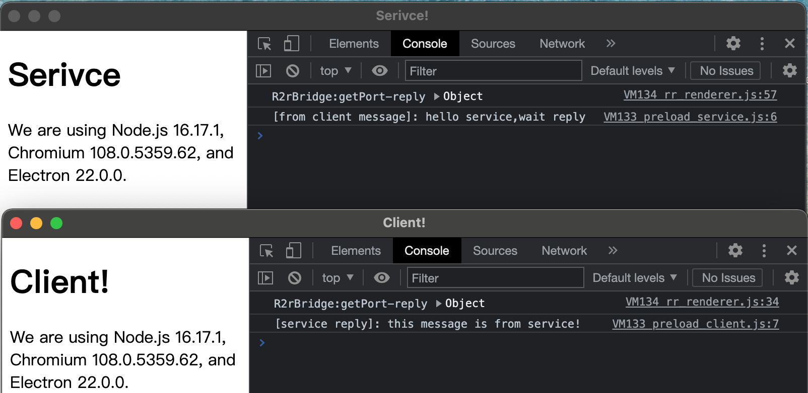

## electron-renderer-to-renderer-bridge

electron-renderer-to-renderer-bridge can helps complete MessagePort access in 3 steps, making it easier to realize communication between independent html windows.

### Useage

```javascript
const { R2rBridgeRenderer, R2rBridgeMain } = require("electron-renderer-to-renderer-bridge");
```

- main process

```javascript
// main.js
R2rBridgeMain.init(clientWindow, serviceWindow); // BrowserWindow register
```

- client renderer page

```javascript
// preload_client.js
const port = await R2rBridgeRenderer.getClientPort(); // return a MessgePort

// then process MessagePort
// port.postMessage("hello service,wait reply");
// port.onmessage = (ev) => {
//   console.log("[service reply]:", ev.data);
// };
```

```javascript
// preload_service.js
const port = await R2rBridgeRenderer.getServicePort(); // return a MessgePort

// then process MessagePort
// port.onmessage = (ev) => {
//   console.log("[from client message]:", ev.data);
//   port.postMessage("this message is from service!");
// };
// port.start();
```

### Snapshot



### Link

[message-ports](https://www.electronjs.org/zh/docs/latest/tutorial/message-ports)\
[Ipc](https://www.electronjs.org/zh/docs/latest/tutorial/ipc)